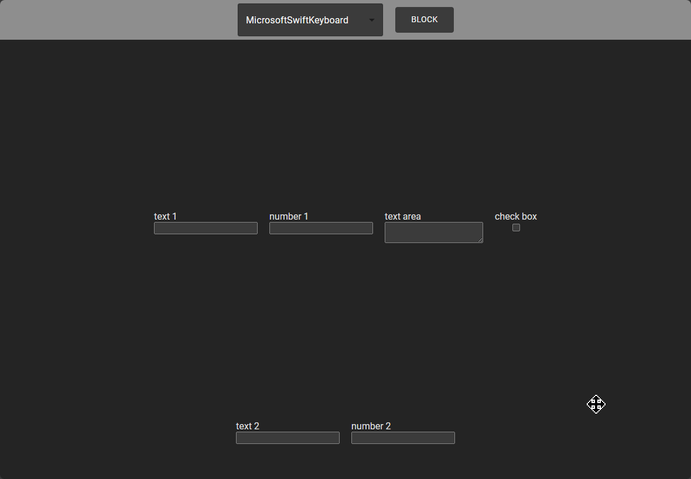
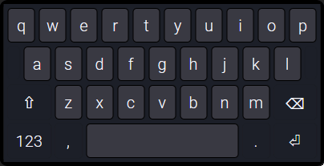
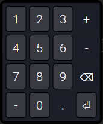
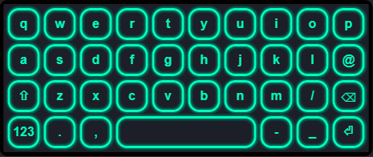
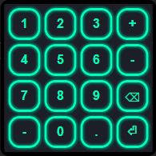
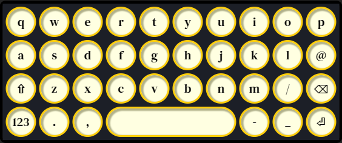
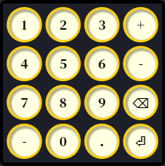

# Custom Virtual Keyboard

### Instalation
The keyboard, available as an npm library, can be easily integrated into other projects with a simple installation command: `npm install @maiiialen/custom-virtual-keyboard@latest`.
Note that you'll need access to the private package to install it.

### Capabilities
With this virtual keyboard, you can:
- **Type without a physical keyboard**: Ideal for touchscreen devices or scenarios where a hardware keyboard isn't available. You can also switch between the virtual keyboard and a physical one as needed without disabling virtual keyboard.
- **Delete characters**: Easily remove characters from your text with backspace functionality.
- **Edit within an input field**: Insert or delete characters at any position within the text, not just at the end.
- **Type in input fields located at the bottom of the page**: The virtual keyboard smartly adjusts page to ensure the input field remains visible, even if the keyboard would typically cover it.
- **Adjust numerical inputs**: Quickly increase or decrease values in numerical fields with built-in controls.

### Theme Options for Virtual Keyboard
The keyboard comes with three different themes, allowing users to choose a style that suits their preferences or application design.

##### Style based on Microsoft Swift Keyboard
 

##### Neon green
 

##### Old typewriter
 

Library used in project: [react simple keyboard](https://www.npmjs.com/package/react-simple-keyboard)